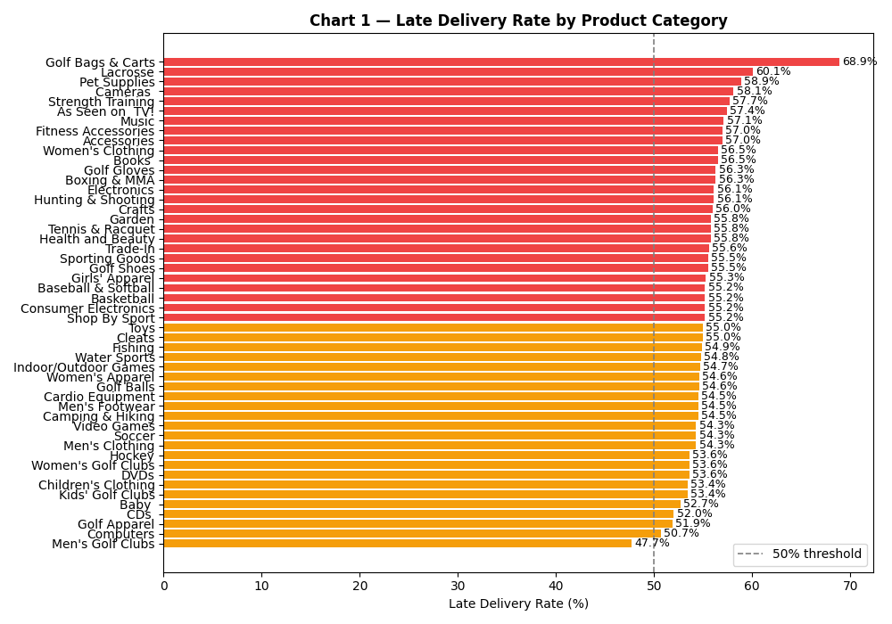
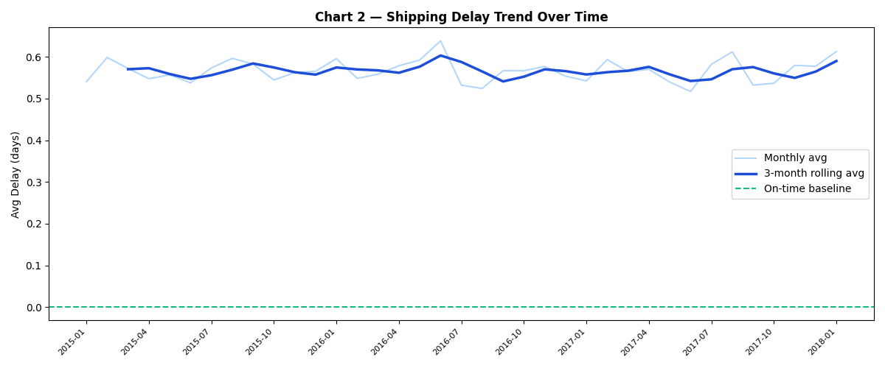
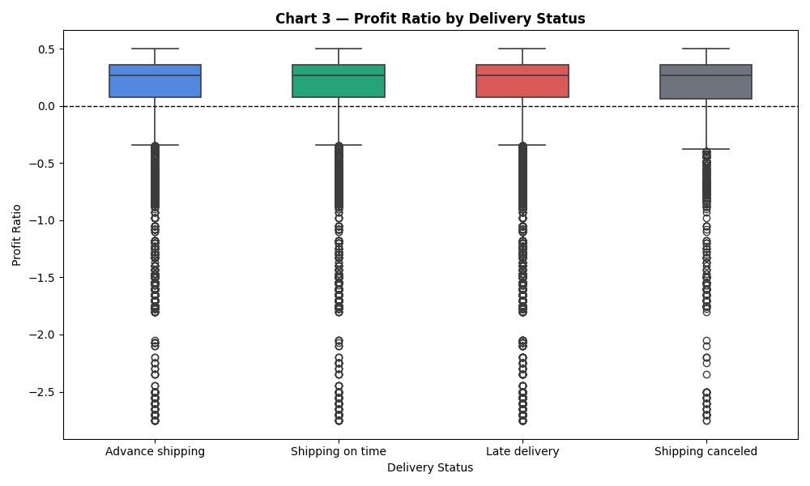
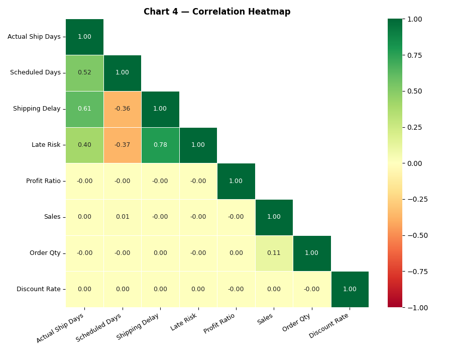
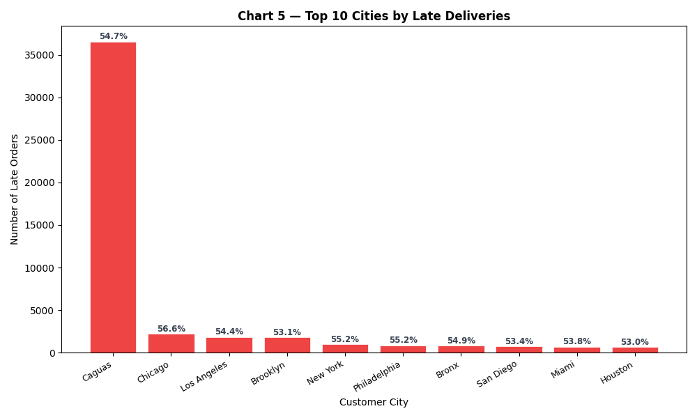

# 🏭 Warehouse Delivery Performance & Profitability Analysis

**Author:** Limbani Fransisqo Chabwera  
**Tools:** Python · Pandas · Matplotlib · Seaborn  
**Dataset:** [DataCo Smart Supply Chain (Kaggle)](https://www.kaggle.com/datasets/shashwatwork/dataco-smart-supply-chain-for-big-data-analysis)  
**Environment:** Google Colab  

---

## 📌 Project Overview

As a warehouse operative with hands-on experience in high-speed, accuracy-critical environments at ALDI UK, I apply data analytics to a real-world supply chain dataset to uncover patterns in delivery performance, late shipment risk, and profitability across product categories and regions.

This project demonstrates end-to-end data analysis: loading and cleaning raw data, engineering new features, visualising trends, and drawing actionable business insights.

---

## ❓ Questions Answered

1. Which product categories have the highest late delivery risk?
2. Has shipping delay improved, worsened, or stayed flat over time?
3. Does delivery status affect profit ratio per order?
4. Which variables correlate most strongly with each other?
5. Which cities generate the most late deliveries?

---

## 📊 Charts & Findings

### Chart 1 — Late Delivery Rate by Product Category


**Finding:** Late delivery is a company-wide problem, not a category-specific one. Almost every category sits between 50–55% late delivery rate. Trade-In and Sporting Goods top the risk at ~55%, while Men's Golf Clubs performs best at 47.7%. No single category is being managed significantly better than others — pointing to a systemic fulfilment issue rather than isolated product problems.

---

### Chart 2 — Shipping Delay Trend Over Time


**Finding:** Average shipping delay hovers consistently between 0.5 and 0.6 days across the entire period with no meaningful improvement. The flat 3-month rolling average confirms this is a structural issue — the company has not made measurable progress in reducing delays over time. For a logistics operation, this represents a significant opportunity for process improvement.

---

### Chart 3 — Profit Ratio by Delivery Status


**Finding:** Profit ratio is remarkably similar across all four delivery statuses — advance shipping, on time, late, and cancelled. This reveals a critical blind spot: the financial cost of late deliveries is not visible in per-order profit. The real cost is being paid in customer satisfaction and retention, not in margin — making it easy for leadership to underestimate the problem.

---

### Chart 4 — Correlation Heatmap


**Finding:** The strongest relationship in the dataset is between Shipping Delay and Late Risk (r = 0.78) — as expected, longer delays drive higher late delivery risk. Scheduled shipping days negatively correlate with delay (r = -0.36), meaning that when more time is built into the schedule, delays reduce. Most strikingly, Profit Ratio shows near-zero correlation with every other variable (r ≈ 0.00), confirming that financial reporting alone will not reveal operational delivery problems.

---

### Chart 5 — Top 10 Cities by Late Deliveries


**Finding:** Late deliveries are concentrated in specific high-volume cities. Targeting logistics improvements in these cities — better carrier partnerships, local warehousing, or route optimisation — could yield the biggest reduction in late delivery volume with the least effort.

---

## 💡 Key Takeaways

| # | Insight |
|---|---------|
| 1 | Over **50% of all orders arrive late** — this is systemic, not seasonal |
| 2 | Shipping delay has shown **no improvement over time** |
| 3 | **Profit per order is unaffected** by delivery status — the real cost is customer trust |
| 4 | Shipping delay and late risk are **strongly correlated (r = 0.78)** |
| 5 | A small number of cities account for a **disproportionate share** of late deliveries |

---

## 🛠️ How to Run This Project

1. Download the dataset from [Kaggle](https://www.kaggle.com/datasets/shashwatwork/dataco-smart-supply-chain-for-big-data-analysis)
2. Open `warehouse_analysis.ipynb` in [Google Colab](https://colab.research.google.com)
3. Upload `DataCoSupplyChainDataset.csv` to your Google Drive
4. Mount your Drive in Colab:
```python
from google.colab import drive
drive.mount('/content/drive')
```
5. Run all cells top to bottom

**Libraries used:**
```
pandas · matplotlib · seaborn · numpy
```

---

## 📁 Repository Contents

| File | Description |
|------|-------------|
| `warehouse_analysis.ipynb` | Full analysis notebook |
| `chart1.png` | Late delivery rate by product category |
| `chart2.png` | Shipping delay trend over time |
| `chart3.png` | Profit ratio by delivery status |
| `chart4.png` | Correlation heatmap |
| `chart5.png` | Top 10 cities by late deliveries |
| `README.md` | This file |

---

## 👤 About Me

I'm a data analyst in training with a BSc in Mathematics, ACCA accounting qualifications, and hands-on experience in warehouse logistics at ALDI UK. This project combines my operational background with Python data analysis skills as part of my transition into a data analyst role.

📧 Connect with me on [LinkedIn](#) · 🐙 More projects on [GitHub](#)

